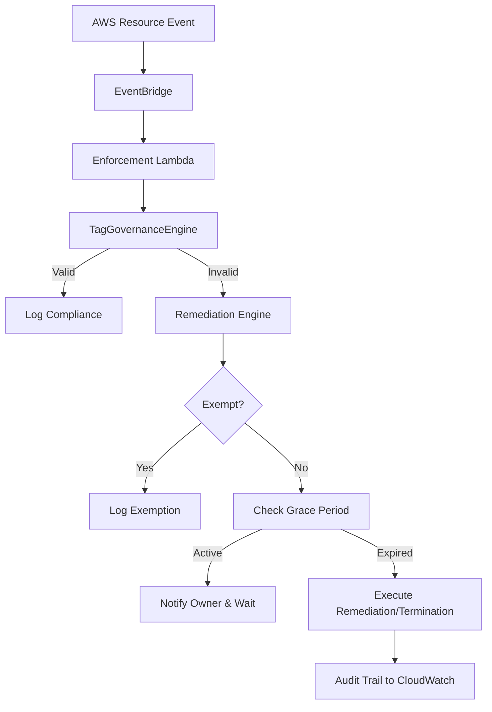

# Architecture

## Part 2: Enterprise Enforcement & Remediation

The Tag Governance platform utilizes an event-driven architecture to detect and remediate non-compliant resources across an AWS Organization.

## Core Components
- **State Store**: Backed by DynamoDB. Tracks first detection times and remediation deadlines.
- **Exemptions**: Managed via JSON or DynamoDB to skip remediation logic.
- **Audit**: All actions are deterministically logged as JSON to CloudWatch.
- **Multi-Account**: Uses `STS AssumeRole` to allow the central governance account to act within member accounts.
