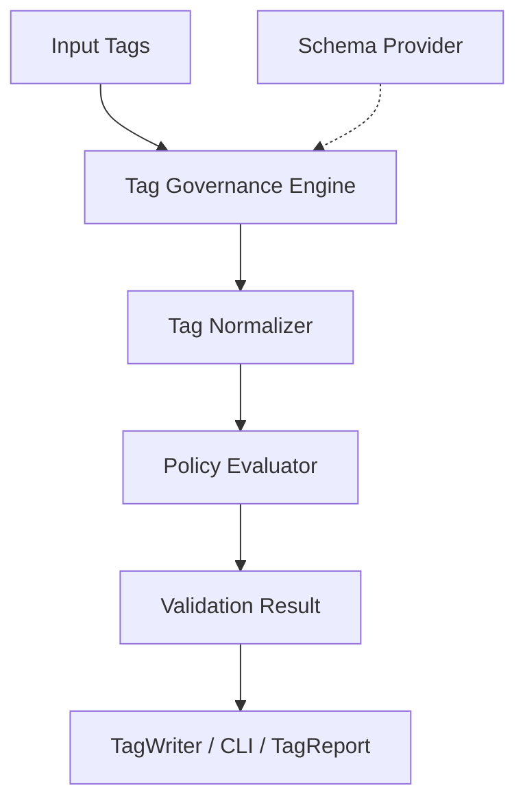

# Tag Governance Foundation

The Tag Governance Foundation introduces an enterprise-grade tagging engine that ensures consistency and compliance across all AWS resources.

## Architecture



## Schema Format

The central tag schema defines the rules. It can be loaded via JSON or YAML.

```yaml
tags:
  Owner:
    description: "The team or individual who owns the resource"
    required: true
  Environment:
    description: "Deployment environment"
    required: true
    allowed_values:
      - dev
      - prod
  CostCenter:
    description: "6-digit cost center code"
    required: true
    pattern: "^[0-9]{6}$"

normalization:
  CostCenter:
    aliases:
      - costcenter
      - COSTCENTER
```

## Validation Rules
The engine applies policies in the following order:
1. **Required Tag Policy**: Checks for missing tags.
2. **Allowed Values Policy (Enum)**: Ensures values are restricted to a defined list.
3. **Regex Policy**: Validates values against a regular expression.
4. **Unknown Tags**: Warns or denies tags not defined in the schema.

## Tag Normalization
Keys with variations like `costcenter` or `env` are normalized to their canonical form (`CostCenter`, `Environment`) before validation. If conflicting keys exist (e.g., both `CostCenter` and `costcenter` are provided with different values), a `NORMALIZATION_CONFLICT` is generated.
